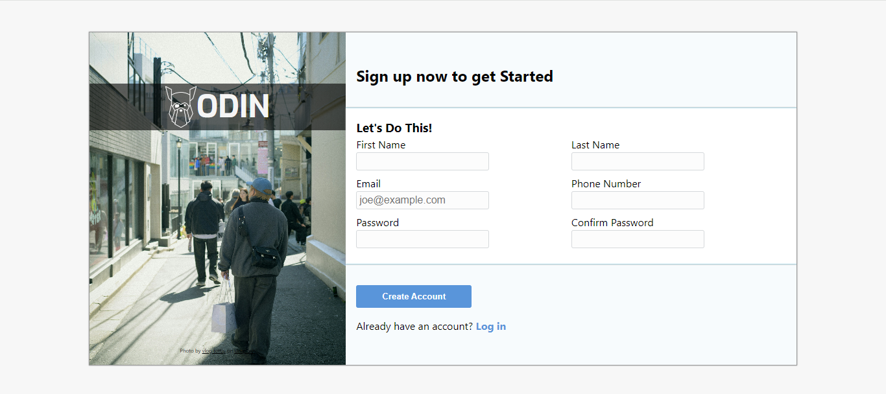

# The Odin Project sign-up-form Project

## Objective
To create a responsive Sign up form using the design file given as a rough guide. Using the skills learnt from previous lesson to now put them to the test to validate inputs and positioning elements effectively.Also, making sure to visually show the user has made an invalid input with `red` input elements and validation messages.

## model 

### index
| Desktop              | Mobile         |
| ------------------------ | ---------------------- |
|  | 

So making this sign-up form was a great way to sink my teeth into vanilla CSS. I've been utilizing a lot of frameworks like Bootstrap and Tailwind, so it's fantastic to truly grasp the syntax and understand it on a deeper level.

Following the project assignment steps, I methodically worked through the layout and order of the file, establishing a solid foundation upon which I could build. Once all my assets were prepared, I dove into filling the gap I had created.

Starting with the `background-image`, drawing from knowledge gained in a previous lesson, it was a breeze to get the picture in place and leverage the relevant properties to position and size the image correctly.

With the power of flex, I could position all my elements in a way that they could adapt to screen size changes, enhancing the UX experience. Using `flex-wrap` seamlessly altered the positioning based on the screen dimensions.

Client-side validation was an area I had little exposure to, as I've primarily worked with server-side validation. Learning about `patterns` and `RegEx` was a true eye-opener. Implementing this within the form and utilizing the `:invalid` pseudo-class to visually indicate mistakes by altering the `border` and `box-shadow` properties was a great experience.

The `:focus` pseudo-class proved invaluable in making the selected input more visible, easier to read, and indeed, easier to focus on. Throughout this project, I made a conscious effort to employ `calc()` and CSS variables, as they were concepts I had limited experience with. It truly streamlined the process of maintaining a consistent theme across the page and keeping everything uniform.

## Problems encountered
- Using the correct `RegEx` for validation
- Making the input elements stack correctly
- Finding the correct layout for the form

## New skills
- Using `RegEx` for validation 
- Correctly using `position` for different elements.
- The use of CSS variables and implementing them.
- Using `calc()` to easily adjust elements.

## languages
- HTML
- CSS

